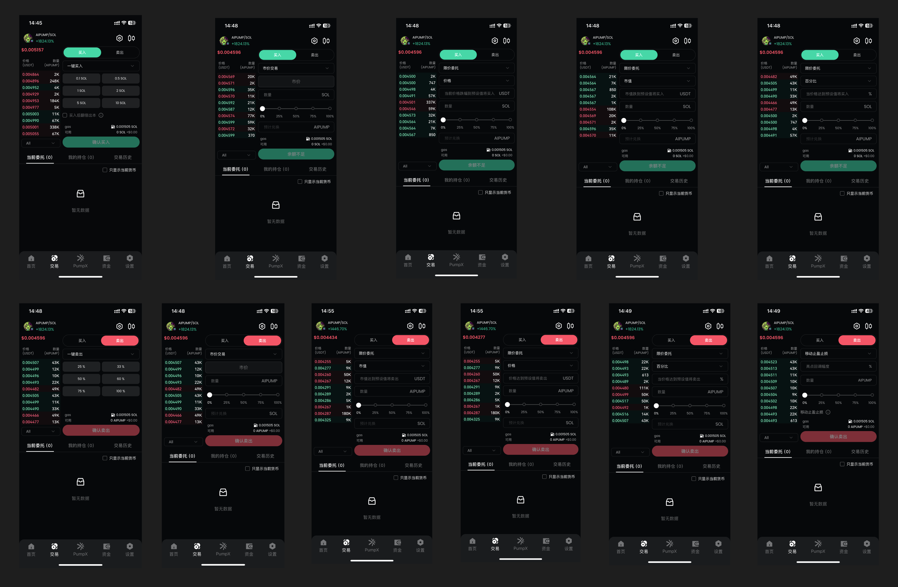

# 交易

PumpX目前支持 “一键买入”、“市价交易”、“限价交易”、“移动止盈止损”等4种类型的交易模式。

<figure><figcaption></figcaption></figure>

1. 针对“一键买入”，我们提供6档价格的默认设置，供用户快速进行交易。同时在“一键买入”模式下，用户可以通过勾选 「翻倍出本」 功能达到在Meme交易时保证本金不受损失的前提下，博取高倍的利润。
2. 针对“市价交易”，会按照当前代币的最新市场价格买入或卖出进行交易。（注意：由于价格不断波动，并且由于流动性等因素，你看到的价格可能与你设置的滑点范围内的实际交易价格不同）
3. 针对“限价交易”，用户可以按照「市值」、「价格」、「百分比」3种方式，对代币进行交易。
4. 针对“移动止盈止损”，此功能可让你通过预先设置回调百分比来跟踪代币的市场价格以获利和止损。当价格达到你预先定义的水平时，市价单将自动执行，帮助用户保护长期收益、在波动期间保护资产并在上升趋势中调整止损

