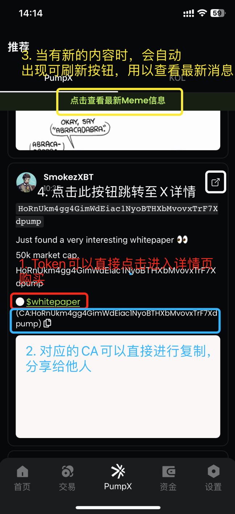

# Meme信息

PumpX通过AI聚合链上链下的数据，生成可以指导交易的相关策略，从而提高用户交易的确定性。PumpX有一个专门的功能用来推送基于AI生成的Meme信息，我们主体推送2方面的内容信息，一个是基于 「影响力、热门趋势」 的重点推特内容、一个是基于 「异动监测、聪明钱买入、量价等多因子」得到的信号推送器给到的代币推送（暂时还未上线，迭代中）。

下面用一张截图进行讲解具体的功能使用：

* 用户可以通过点击对应的代币，直接进入详情页进行购买
* 对应的CA点击后可以直接复制，分享给他人
* 当有新内容时，顶部会自动出现可刷新按钮，用户可以通过点击此按钮查看最新推荐消息
* 点击模块右上角的跳转按钮，可以跳转至X详情查看对应的X内容

