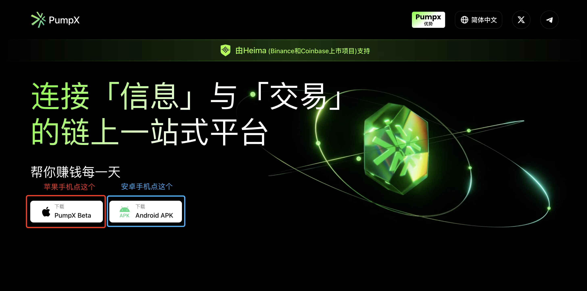

# 快速上手

### 1. 下载App

目前苹果应用商店和谷歌应用商店均在审核中，暂时用户需要通过 「官网」 或者 「邀请链接」 进行下载。

* 通过 「官网」：点击 [https://www.pumpx.ai](https://www.pumpx.ai) 进入官网。如果你是苹果手机，点击左侧按钮下载；如果你是安卓手机，点击右侧按钮下载

<figure><figcaption></figcaption></figure>

如果你是苹果手机，点击红圈中的按钮后，会跳转至以下页面：

<figure><figcaption></figcaption></figure>

* 如果你有Testflight App，则可以直接点击第二步中的按钮去下载 PumpX App
* 如果你没有Testflight App，则可以从第一步开始去苹果应用商店先下载Testflight App，之后再点击第二步中的按钮，去下载 PumpX App

如果你是安卓手机，点击蓝圈中的按钮后，会直接开始下载安卓APK，下载到本地后，可以直接点击进行应用安装

* 如果你是小米或者华为的手机，可能存在安装的时候该机型不允许你安装的提示，不用担心产品的风险，我们已经通过了顶级安全公司 「慢雾」 的审计，此时直接断网或者开启飞行模式后，再次安装即可

你也有可能是通过点击他人发给你的邀请链接进行下载安装，以此邀请链接为例：[https://www.pumpx.ai/refer?inviteCode=JAZLII](https://www.pumpx.ai/refer?inviteCode=JAZLII)。 当你点击此链接后，会直接弹出注册的页面，按照步骤完成注册账号之后，再去下载App进行登录使用。

### 2. App首页

<figure><figcaption></figcaption></figure>

使用你注册好的账号进行登录后，你会进入到App首页。首页包含4个模块，如上图所示：

1. 搜索模块：你可以通过粘贴CA或者代币的名称进行搜索，然后交易
2. 资产模块：首页会罗列出当前钱包下你的资产总量，你可以切换钱包进行不同钱包的查询
3. 顶部banner：运营活动位，会根据市场环境的变化，展示不同的banner
4. 代币展示：根据时间段的不同，展示对应的涨幅排行榜

### 3. 充值（入金）

如果你是刚登录App，那么首页会展示「充值」入口，如2中的图片所示。你也可以通过在「资金」页面，点击「充值」进行入金。

<figure><figcaption></figcaption></figure>

在这个页面中，你可以看到一个二维码和一串Solana地址。接下来以币安交易所为例，如何通过币安交易所进行转账至PumpX钱包中（注：其他的交易所也是类似的步骤）。

<figure><figcaption></figcaption></figure>

1. 首先确保你的交易所钱包中有SOL资产，然后在交易所中对SOL进行提现
2. 第一步：对SOL资产进行提现，点击「提现」按钮
3. 第二步：选择 「通过区块链转账」&#x20;
4. 第三步：此处需要填写地址和选择网络。地址就填写你PumpX中收款页面的地址，网络则选择Solana网络。接下来再填写你需要转账的Sol数量
5. 第四步：全部填写完毕后，点击「提现」，然后等待Sol网络执行你的操作，过一会你就应该能在PumpX资产页面看到对应的Sol数量

现在你已经有了Sol的资产了，可以进行「交易」相关的操作了。

### 4. 交易

目前PumpX有3大交易的场景：

1. 首页有基于不同时间段内的涨幅排行榜，这就相当于全网该网络下交易量最靠前的代币
2. PumpX主打的AI推荐代币的地方，即中间的PumpX，我们基于代币的k线量价、市场的趋势热度、聪明钱的买卖信息等综合在一起的信号进行AI代币推荐。里面有2种推荐代币的逻辑，侧重点有所不同。左侧的 「AI代理」 更侧重于聪明钱和代币的k线量价，右侧的 「推特新闻」 更侧重于市场的趋势信息
   1. AI代理区分了2种模式，一种是「激进版」，用来博取更高倍率的收益；一种是「保守版」，更多是在保障用户本金的情况下能有一些收益。
   2. 推特新闻则是基于市场的趋势变化下，我们挑选出的与代币相关的一些热门内容。推特账号处罗列出了该账号的关注人数（包含是否有著名关注者）、推文数量、历史是否改名过等描述，进一步帮助用户确认相关信息

<figure><figcaption></figcaption></figure>

3. 通过搜索直接进行相应的代币购买。用户可以通过直接贴CA的方式进行搜索，也可以搜索代币的名称进行查询

<figure><figcaption></figcaption></figure>

* 点击代币后进入代币详情页：
  * 顶部展示代币的4个参数，24h成交额、流通市值、持有人、24h交易额
  * 中部展示不同时间段内的k线
  * 底部展示所有的实时成交记录，以及Token持有人的比例数据
* 用户可以在当前页面，点击 「一键交易」，直接在详情页购买。边看k线边买，同时支持用户选择 「翻倍出本」
* 买入一个代币，支持3种模式，一键买入、市价交易、限价委托
* 卖出一个代币，支持4种模式，一键卖出、市价交易、限价委托、移动止盈止损

<figure><figcaption></figcaption></figure>

