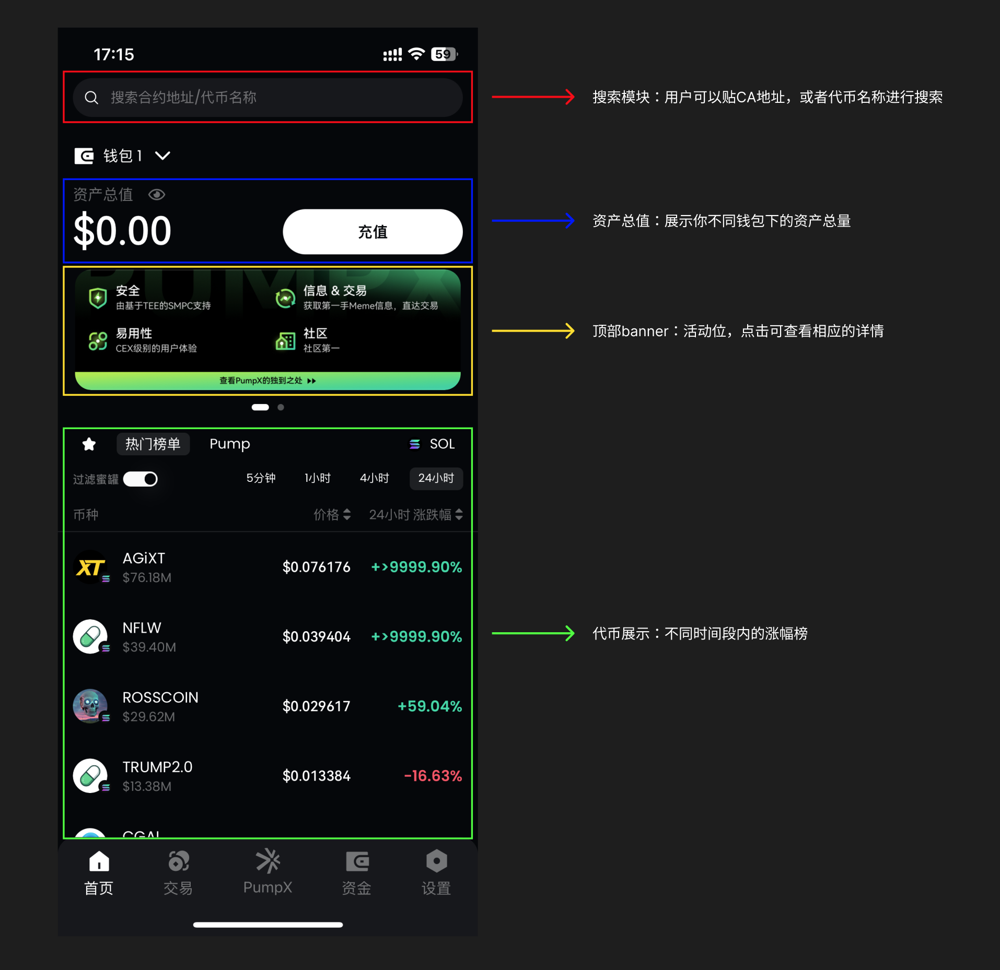

# 快速上手

### 1. 首页

<figure><figcaption></figcaption></figure>

* 用户可以通过复制CA或者代币名称进行搜索
* 顶部展示的轮播图，用户可以点击后查看详情内容
* 底部展示的是不同时间段内，涨跌幅靠前的相应热门代币

### 2. 交易

<figure><figcaption></figcaption></figure>

* 点击代币后进入代币详情页：
  * 顶部展示代币的4个参数，24h成交额、流通市值、持有人、24h交易额
  * 中部展示不同时间段内的k线
  * 底部展示所有的实时成交记录，以及Token持有人的比例数据
* 用户可以在当前页面，点击 「一键交易」，直接在详情页购买。边看k线边买，同时支持用户选择 「翻倍出本」
* 买入一个代币，支持3种模式，一键买入、市价交易、限价委托
* 卖出一个代币，支持4种模式，一键卖出、市价交易、限价委托、移动止盈止损

### 3. 信息流（PumpX页面）

<figure><figcaption></figcaption></figure>

* 我们有2种不同的AI Agent，一个是激进版、一个是保守版，激进版的AI会推出更多可能带来高倍率的代币，保守版的AI则更多会在保护你本金的基础上，推荐一些买入可能会有涨幅的代币
* PumpX信息流页面则是聚合了X上与Crypto相关有热度的帖子，帖子中带有代币的相关信息
